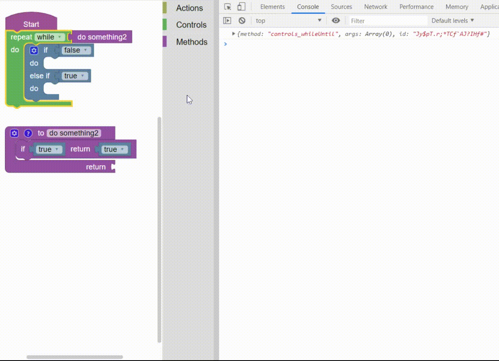

## Request structure

```javascript
{
    method: 'move',
    args: ['UP'],
    id: '(*cM@^G:(F3xV7Hx{D=y'
}
```

Each `request` is generated by the blocks and has the following `properties`.

| Name | Description |
| --- | --- |
| `method` | Type: `String`<br><br>A string that represent the purpose of the request |
| `args` | Type: `Array`<br><br>An array of arguments|
| `id` | Type: `String`<br><br>The id of the block that generated the request|

To see how the block generate the requests see the [`Blocks`](https://paol-imi.github.io/blockly-gamepad/#/blocks) chapter.

## State request

The state requests are not generated by the blocks. See how they works in the [`workflow`](https://paol-imi.github.io/blockly-gamepad/#/workflow?id=workflow-structure) chapter.

```javascript
// STARTED
{ 
  method: Blockly.Gamepad['STATES']['STARTED'], 
  id: Blockly.Gamepad['STATES']['STARTED']
}
// FINISHED
{
  method: Blockly.Gamepad['STATES']['FINISHED'], 
  id: Blockly.Gamepad['STATES']['FINISHED']
}
// COMPLETED
{
  method: Blockly.Gamepad['STATES']['COMPLETED'], 
  id: Blockly.Gamepad['STATES']['COMPLETED']
}
```

## Request information

The requests are passed to the game. With each request two other parameters are passed, `back` and `old`.


- `back` - True if the request is passed while the game is playing backwards, otherwise false
-  `old` - True if the request has already been passed to the game before, otherwise false
 

```javascript
class Game {
  manageRequests(request, back, old) {
    // requests are passed here
  }
}
```


## Wrap the default blocks



The requests are generated only by the blocks that are initialized with the `gamepad`. <br> With this feature you can wrap the code generators of the standard Blockly blocks (such as the while cycle) to allow them to generate `requests`.

```javascript
Blockly.Gamepad.init({
  wrap: [
    // procedures
    'procedures_defnoreturn',
    'procedures_defreturn',
    'procedures_callreturn',
    'procedures_callnoreturn',
    // controls
    'controls_if',
    'controls_whileUntil',
    // logic
    'logic_boolean'
    ...
  ]
})
```

## Custom code generators

It's possible to set custom `code generators` for the blocks. A request can be generated using:

> Blockly.Gamepad.utils.request( `method`, `args`, `id` )

```javascript
Blockly.Javascript["move_up"] = function(block) {
  let code = "do something...",
      request = Blockly.Gamepad.utils.request('MOVE', ['UP'], block.id)

  return code + "\n" + request
}
```
Set some data in the global `context`.

```javascript
Blockly.Gamepad["CONTEXT"] = {
  foo: "bar"
}
```

```javascript
Blockly.Javascript["move_up"] = function() {
  // the data will be parsed wehn the block generate the request
  return "console.log( CONTEXT.foo );\n"
  // expected output 
  // > 'bar' 
}
```

The default code generator is:

> Blockly.Gamepad.utils.js( `method`, `args`, `order`, `template`, `statements`)
